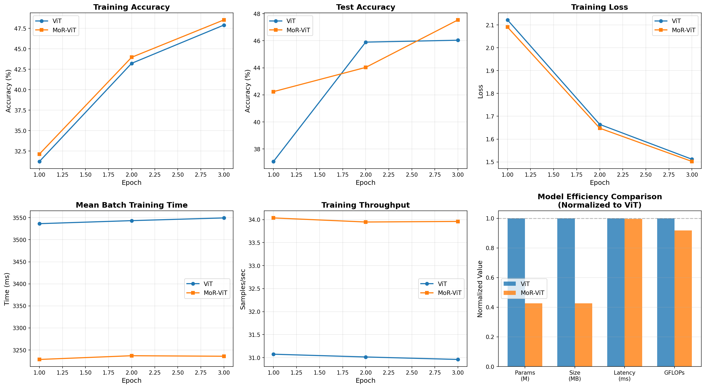

# Vision-MoR
We have implemented a Mixture of Regressions (MoR) inspired architecture for vision tasks. For base model, we have used the ViT architecture from transformers library, with a custom configuration, and compared it against our model. This repository contains the code and instructions to reproduce the results presented below.

## Installation
To install the required dependencies, please run the following command:

```bash
pip install -r requirements.txt
```
## Usage
To compare the MoR and against the ViT, use the following command: 

```bash
python -m scripts.custom_config.metrics
```

This will run both models on CIFAR-10 dataset and output the results for comparison.

## Results
The results of our experiment are as follows:

| Metric          | ViT architecture | Vision MoR (our) | Improvement |
|----------------|------------------|------------------|-------------|
| Parameters (M)       | 4.83             | 1.68             | 65.3%       |
| Model Size (MB)           | 18.44            | 6.40             | 65.3%       |
| Inference Latency (ms)   | 117.38           | 46.24            | 60.6%       |
| Throughput (samples/s)  | 4361.86          | 11071.98         | 153.8%      |
| GFLOPs                 | 0.31             | 0.10             | 66.4%       |
| Final Test Accuracy (%)   | 64.98            | 62.81            | -2.17%      |
| Peak Training Memory (MB) | 3426.17          | 1375.01          | 59.9%       |



## Conclusion
The Vision MoR architecture demonstrates similar Training and Test Accuracy and Loss compared to a classic ViT, while achieving significant improvement in Training time, throughput and efficiency in CIFAR-10 dataset.

## License
This project is licensed under the MIT License. See the [LICENSE](LICENSE) file for details.

## Acknowledgements
This work was inspired by the paper [Mixture of Recursion (MoR)](https://arxiv.org/abs/2507.10524).